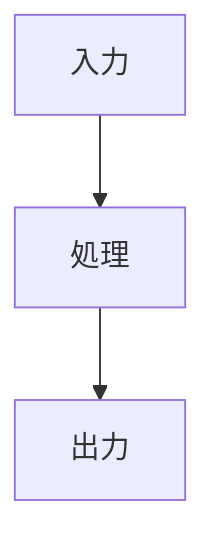

# Markdown チートシート（GitHub向け・コピペ用）

GitHub でそのまま使いやすい Markdown 記法を並べてまとめる。

---

## 目次
  - [目次](#目次)
  - [1. 見出し](#1-見出し)
  - [2. 段落と改行](#2-段落と改行)
  - [3. 強調](#3-強調)
  - [4. 箇条書き](#4-箇条書き)
  - [5. チェックリスト](#5-チェックリスト)
  - [6. 引用](#6-引用)
  - [7. 区切り線](#7-区切り線)
  - [8. リンク](#8-リンク)
  - [9. 画像](#9-画像)
  - [10. コードブロック](#10-コードブロック)
  - [11. 表](#11-表)
  - [12. エスケープ](#12-エスケープ)
  - [13. 折りたたみ](#13-折りたたみ)
  - [14. GitHub Alerts](#14-github-alerts)
  - [15. 数式（GitHubで表示しやすい書き方）](#15-数式githubで表示しやすい書き方)
    - [15.1 インライン数式](#151-インライン数式)
    - [15.2 ブロック数式](#152-ブロック数式)
    - [15.3 複数行の数式](#153-複数行の数式)
    - [15.4 行列](#154-行列)
  - [16. 脚注](#16-脚注)
  - [17. Mermaid 図](#17-mermaid-図)
  - [18. よく使う README テンプレート](#18-よく使う-readme-テンプレート)
  - [19. 最低限これだけ覚えるセット](#19-最低限これだけ覚えるセット)
  - [20. 学習ノート用テンプレート](#20-学習ノート用テンプレート)
---

## 1. 見出し

### コピペ用

```markdown
# 見出し1
## 見出し2
### 見出し3
#### 見出し4
```

### 表示例

# 見出し1
## 見出し2
### 見出し3
#### 見出し4

---

## 2. 段落と改行

### コピペ用

```markdown
これは1つ目の段落です。

これは2つ目の段落です。
```

### 表示例

これは1つ目の段落です。

これは2つ目の段落です。

### コピペ用

```markdown
1行目の末尾に半角スペースを2つ入れる  
2行目
```

### 表示例

1行目の末尾に半角スペースを2つ入れる  
2行目

---

## 3. 強調

### コピペ用

```markdown
**太字**
*斜体*
***太字かつ斜体***
~~打ち消し~~
`inline code`
```

### 表示例

**太字**  
*斜体*  
***太字かつ斜体***  
~~打ち消し~~  
`inline code`

---

## 4. 箇条書き

### コピペ用

```markdown
- りんご
- みかん
  - 温州みかん
  - はっさく
- ぶどう
```

### 表示例

- りんご
- みかん
  - 温州みかん
  - はっさく
- ぶどう

### コピペ用

```markdown
1. はじめに
2. インストール
3. 実行
```

### 表示例

1. はじめに
2. インストール
3. 実行

---

## 5. チェックリスト

### コピペ用

```markdown
- [ ] README を書く
- [x] GitHub に push する
- [ ] 画像を追加する
```

### 表示例

- [ ] README を書く
- [x] GitHub に push する
- [ ] 画像を追加する

---

## 6. 引用

### コピペ用

```markdown
> これは引用です。
>
> 2行目も引用です。
```

### 表示例

> これは引用です。
>
> 2行目も引用です。

---

## 7. 区切り線

### コピペ用

```markdown
---
```

### 表示例

---

## 8. リンク

### コピペ用

```markdown
[GitHub](https://github.com)
```

### 表示例

[GitHub](https://github.com)

### コピペ用

```markdown
https://github.com
```

### 表示例

https://github.com

---

## 9. 画像

### コピペ用

```markdown

```

### 表示例

画像がその場に表示される。

### コピペ用

```markdown
[](images/sample.png)
```

### 表示例

画像をクリックして元画像を開ける形になる。

---

## 10. コードブロック

### コピペ用

````markdown
```python
def hello():
    print("Hello, world!")
```
````

### 表示例

```python
def hello():
    print("Hello, world!")
```

### コピペ用

````markdown
```bash
git status
git add .
git commit -m "update"
```
````

### 表示例

```bash
git status
git add .
git commit -m "update"
```

### コピペ用

````markdown
```powershell
python -m venv .venv
.venv\Scripts\Activate.ps1
```
````

### 表示例

```powershell
python -m venv .venv
.venv\Scripts\Activate.ps1
```

---

## 11. 表

### コピペ用

```markdown
| 名前 | 言語 | 用途 |
| --- | --- | --- |
| NumPy | Python | 数値計算 |
| JAX | Python | 高速計算 |
| Git | CLI | バージョン管理 |
```

### 表示例

| 名前 | 言語 | 用途 |
| --- | --- | --- |
| NumPy | Python | 数値計算 |
| JAX | Python | 高速計算 |
| Git | CLI | バージョン管理 |

### コピペ用

```markdown
| 左寄せ | 中央寄せ | 右寄せ |
| :--- | :---: | ---: |
| A | B | 100 |
| C | D | 200 |
```

### 表示例

| 左寄せ | 中央寄せ | 右寄せ |
| :--- | :---: | ---: |
| A | B | 100 |
| C | D | 200 |

---

## 12. エスケープ

### コピペ用

```markdown
\*これは箇条書きにならない
\#これは見出しにならない
\`これはコードにならない
```

### 表示例

\*これは箇条書きにならない  
\#これは見出しにならない  
\`これはコードにならない

---

## 13. 折りたたみ

### コピペ用

```markdown
<details>
<summary>クリックして開く</summary>

ここに補足説明を書けます。

- 箇条書き
- コード
- 画像

</details>
```

### 表示例

<details>
<summary>クリックして開く</summary>

ここに補足説明を書けます。

- 箇条書き
- コード
- 画像

</details>

---

## 14. GitHub Alerts

GitHub 特有の callout 記法。

### NOTE

#### コピペ用

```markdown
> [!NOTE]
> 補足情報です。
```

#### 表示例

> [!NOTE]
> 補足情報です。

### TIP

#### コピペ用

```markdown
> [!TIP]
> 便利なコツです。
```

#### 表示例

> [!TIP]
> 便利なコツです。

### IMPORTANT

#### コピペ用

```markdown
> [!IMPORTANT]
> これは重要事項です。
```

#### 表示例

> [!IMPORTANT]
> これは重要事項です。

### WARNING

#### コピペ用

```markdown
> [!WARNING]
> 注意してください。
```

#### 表示例

> [!WARNING]
> 注意してください。

### CAUTION

#### コピペ用

```markdown
> [!CAUTION]
> 危険や不利益につながる可能性があります。
```

#### 表示例

> [!CAUTION]
> 危険や不利益につながる可能性があります。

### 複数行の例

#### コピペ用

```markdown
> [!IMPORTANT]
> この設定は一度変更すると戻しにくいです。  
> 実行前にバックアップを取ってください。
```

#### 表示例

> [!IMPORTANT]
> この設定は一度変更すると戻しにくいです。  
> 実行前にバックアップを取ってください。

---

## 15. 数式（GitHubで表示しやすい書き方）

GitHub では、インライン数式に `$`...`$`、ブロック数式に `math` コードブロックを使える。

### 15.1 インライン数式

#### コピペ用

```markdown
$`x, y \in \mathbb{R}`$
```

#### 表示例

$`x, y \in \mathbb{R}`$

#### コピペ用

```markdown
$`\theta = (\theta_0, \theta_1) \in \mathbb{R}^{2}`$
```

#### 表示例

$`\theta = (\theta_0, \theta_1) \in \mathbb{R}^{2}`$

---

### 15.2 ブロック数式

#### コピペ用

````markdown
```math
\begin{align*}
f_\theta(x) = \theta_0 + \theta_1 x
\quad
\theta = (\theta_0, \theta_1) \in \mathbb{R}^{2}
\end{align*}
```
````

#### 表示例

```math
\begin{align*}
f_\theta(x) = \theta_0 + \theta_1 x
\quad
\theta = (\theta_0, \theta_1) \in \mathbb{R}^{2}
\end{align*}
```

---

### 15.3 複数行の数式

#### コピペ用

````markdown
```math
\begin{align*}
L(\theta)
&= \sum_{i=1}^{n} \left( y_i - f_\theta(x_i) \right)^2 \\
f_\theta(x)
&= \theta_0 + \theta_1 x
\end{align*}
```
````

#### 表示例

```math
\begin{align*}
L(\theta)
&= \sum_{i=1}^{n} \left( y_i - f_\theta(x_i) \right)^2 \\
f_\theta(x)
&= \theta_0 + \theta_1 x
\end{align*}
```

---

### 15.4 行列

#### コピペ用

````markdown
```math
A =
\begin{pmatrix}
1 & 2 \\
3 & 4
\end{pmatrix}
```
````

#### 表示例

```math
A =
\begin{pmatrix}
1 & 2 \\
3 & 4
\end{pmatrix}
```

---

## 16. 脚注

### コピペ用

```markdown
これは脚注の例です。[^1]

[^1]: ここが脚注です。
```

### 表示例

これは脚注の例です。[^1]

[^1]: ここが脚注です。

---

## 17. Mermaid 図

### コピペ用

````markdown

````

### 表示例


---

## 18. よく使う README テンプレート

### コピペ用

````markdown
# プロジェクト名

## 概要
このプロジェクトは〇〇を行うためのものです。

## 環境
- Python 3.12
- JAX
- NumPy

## インストール

```bash
pip install -r requirements.txt
```

## 使い方

```bash
python main.py
```

## 例

> [!IMPORTANT]
> 実行前に仮想環境を有効化してください。

## 数式

$`x, y \in \mathbb{R}`$

```math
\begin{align*}
f_\theta(x) = \theta_0 + \theta_1 x
\end{align*}
```
````

### 表示例

# プロジェクト名

## 概要
このプロジェクトは〇〇を行うためのものです。

## 環境
- Python 3.12
- JAX
- NumPy

## インストール

```bash
pip install -r requirements.txt
```

## 使い方

```bash
python main.py
```

## 例

> [!IMPORTANT]
> 実行前に仮想環境を有効化してください。

## 数式

$`x, y \in \mathbb{R}`$

```math
\begin{align*}
f_\theta(x) = \theta_0 + \theta_1 x
\end{align*}
```

---

## 19. 最低限これだけ覚えるセット

### コピペ用

````markdown
# 見出し

## 小見出し

- 箇条書き
- 箇条書き

1. 番号付き
2. 番号付き

`inline code`

```python
print("hello")
```

[リンク](https://github.com)

> [!IMPORTANT]
> 重要事項

$`x \in \mathbb{R}`$

```math
x^2 + y^2 = 1
```
````

### 表示例

# 見出し

## 小見出し

- 箇条書き
- 箇条書き

1. 番号付き
2. 番号付き

`inline code`

```python
print("hello")
```

[リンク](https://github.com)

> [!IMPORTANT]
> 重要事項

$`x \in \mathbb{R}`$

```math
x^2 + y^2 = 1
```

---

## 20. 学習ノート用テンプレート

### コピペ用

````markdown
# 学習ノート: テーマ名

## 目標
- 何を理解したいか
- 何を実装したいか

## 要点
- ポイント1
- ポイント2

## 重要な式
$`x, y \in \mathbb{R}`$

```math
\begin{align*}
f_\theta(x) = \theta_0 + \theta_1 x
\end{align*}
```

## 重要なコード

```python
def f(x, theta0, theta1):
    return theta0 + theta1 * x
```

## 注意
> [!WARNING]
> 実装では入力の shape を確認すること。

## 次回やること
- [ ] 復習
- [ ] 実装
- [ ] 図を追加
````

### 表示例

# 学習ノート: テーマ名

## 目標
- 何を理解したいか
- 何を実装したいか

## 要点
- ポイント1
- ポイント2

## 重要な式
$`x, y \in \mathbb{R}`$

```math
\begin{align*}
f_\theta(x) = \theta_0 + \theta_1 x
\end{align*}
```

## 重要なコード

```python
def f(x, theta0, theta1):
    return theta0 + theta1 * x
```

## 注意
> [!WARNING]
> 実装では入力の shape を確認すること。

## 次回やること
- [ ] 復習
- [ ] 実装
- [ ] 図を追加
```

必要なら次に、**そのまま `README.md` として使える完成版テンプレート**を同じ形式で作れる。